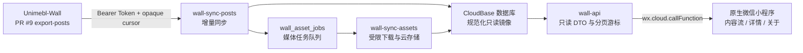

# 墨大墙微信小程序（只读镜像）

一个基于原生微信小程序与 CloudBase 的公开内容只读镜像。项目从墨大墙主站的受保护变更流增量同步数据，在 CloudBase 中建立面向阅读场景的公开投影，再通过单一只读云函数向小程序提供内容列表、分类、详情和同步状态。

> 当前仓库提供可部署的基础架构，不包含任何生产环境密钥或 CloudBase 环境 ID。源站同步依赖 [Unimebl-Wall PR #9：token-protected post mirror export API](https://github.com/CorCvusRamboChen/Unimebl-Wall/pull/9) 定义的 `export-posts` 变更流。PR #9 已合并；正式上线前仍需确认 `0033_post_export_api.sql` 已应用、Edge Function 已部署并配置密钥。

## 当前实现一览

| 层级 | 当前实现 |
| --- | --- |
| 小程序端 | 原生 WXML / WXSS / JavaScript；内容流、分类筛选、下拉刷新、游标分页、详情、图片预览、MP4 播放、关于与同步状态 |
| 客户端数据层 | `wx.cloud.callFunction` 调用封装；列表首屏与详情的 5 分钟本地缓存；统一中文错误提示 |
| 只读网关 | `wall-api`；固定动作路由、参数校验、公开 DTO、分类绑定游标和内部错误脱敏 |
| 内容同步 | `wall-sync-posts`；Bearer Token 鉴权、不透明源游标、顺序校验、幂等投影、分布式锁和运行记录 |
| 媒体同步 | `wall-sync-assets`；任务队列、精确域名白名单、HTTPS / MIME / 大小校验、CloudBase 存储镜像和重试 |
| 数据存储 | 7 个 CloudBase 集合，分别保存公开读模型、同步状态、执行记录和媒体任务 |
| 本地质量门禁 | Node.js 内置测试运行器 + JavaScript / JSON 语法检查；不依赖真实 CloudBase 环境 |

## 目录

- [当前实现一览](#当前实现一览)
- [功能与边界](#功能与边界)
- [母项目复核结论](#母项目复核结论)
- [整体架构](#整体架构)
- [项目结构](#项目结构)
- [页面与模块职责](#页面与模块职责)
- [技术要求](#技术要求)
- [快速开始](#快速开始)
- [CloudBase 配置](#cloudbase-配置)
- [云函数部署](#云函数部署)
- [首次同步与验证](#首次同步与验证)
- [小程序只读 API](#小程序只读-api)
- [数据模型](#数据模型)
- [同步一致性](#同步一致性)
- [安全与隐私](#安全与隐私)
- [测试与质量检查](#测试与质量检查)
- [已知限制与运维注意](#已知限制与运维注意)
- [上线检查清单](#上线检查清单)
- [常见问题](#常见问题)
- [相关文档](#相关文档)

## 功能与边界

### 已实现

- 原生微信小程序内容流：首页加载、分类筛选、下拉刷新和游标分页。
- 内容详情：标题、作者公开信息、发布时间、纯文本正文、评论数量、图片预览和 MP4 播放。
- 匿名帖：使用源站显式 `isAnonymous` 信号，强制移除作者关联、头像和认证标记。
- 同步状态反馈：显示最近成功同步时间，并在 `degraded` / `unhealthy` 时继续提供旧数据和明确警告。
- 本地轻量缓存：按分类缓存列表首屏、按 ID 缓存详情，默认有效期为 5 分钟；每次打开仍会后台请求正式数据。
- CloudBase 只读 API：统一处理参数校验、DTO 序列化、错误格式和分页游标。
- 增量同步：幂等消费源站 `board`、`author`、`post` 和 `post_media` 变更。
- 删除与隐藏传播：支持源站软删除、隐藏状态和物理删除事件。
- 媒体镜像：通过受限任务队列把允许的 HTTPS 图片和 MP4 复制到 CloudBase 存储。
- 运维状态：记录同步游标、执行历史、连续失败次数和最近成功时间。
- 自动化验证：覆盖变更流契约、十进制序列、游标、帖子投影、媒体 URL 安全、客户端用词和关键布局约束。

### 第一版明确不做

- 微信登录、账号绑定或主站账号体系接入。
- 发帖、编辑、删除、点赞、收藏、投票或举报。
- 评论正文、私信、通知和用户关系。
- 小程序客户端直连 Supabase、源站数据库或源站导出接口。
- 在客户端展示源媒体 URL、服务端密钥或内部管理字段。

项目的目标是“可靠地只读浏览公开内容”，不是复刻主站的全部交互能力。

## 母项目复核结论

2026-08-19 对母项目默认分支和 PR #9 重新核对后，下游适配范围如下：

- PR #9 已于 2026-08-06 合并，`export-posts` 仍使用 `apiVersion: "1"`。
- 帖子 payload 在合并前增加了 `isAnonymous`；本项目现在按显式字段脱敏，不再只靠空 `authorId` 推断。
- 母项目的导入帖已经会产生 `post_media.type=video` 的 MP4；本项目现在对图片和视频分别校验 MIME、镜像并展示。
- 母项目后来新增了转载来源字段和 `comment_media`，但它们尚未加入 `export-posts` v1 白名单。本项目不会猜测或绕过契约读取这些数据。
- `export-posts` 的核心实现和 `0033_post_export_api.sql` 在合并后没有新的契约提交；详细字段映射见 [源 API 映射](docs/source-api-contract.md)。

## 整体架构



核心原则：

1. **源站只暴露受保护的变更流。** 同步 Token 仅存在于 `wall-sync-posts` 的云函数环境变量中。
2. **小程序只访问镜像。** 客户端只能调用 `wall-api`，不掌握源站 URL、Token 或数据库访问能力。
3. **镜像采用公开字段白名单。** CloudBase 数据不等同于源库备份，只保存阅读功能需要的公开投影。
4. **媒体单独处理。** 帖子同步只创建任务；媒体函数完成域名校验、大小限制和云存储复制。
5. **游标按页提交。** 一页事件全部处理成功后才推进游标，失败只会造成安全重放，不会跳过事件。

### 客户端读取路径

1. `app.js` 根据 `develop / trial / release` 选择 CloudBase 环境并初始化 `wx.cloud`。
2. 内容流和详情页先尝试读取 5 分钟内的本地缓存，再通过 `services/wall-api.js` 调用 `wall-api`。
3. `wall-api` 校验固定动作和参数，只查询 `mirror_status=published` 且 `board_enabled=true` 的读模型。
4. 云函数把内部记录序列化为最小公开 DTO；源媒体 URL、内部状态和错误堆栈不会返回客户端。
5. 列表页更新首屏缓存并展示同步状态；详情页只渲染纯文本和已完成镜像的 CloudBase `fileID`。

### 增量同步路径

1. `wall-sync-posts` 获取事务锁，从 `wall_sync_state.cursor` 继续请求 `export-posts`。
2. 函数校验 API 版本、源实例、事件顺序与 payload，再按 `board → author → post → post_media` 实际事件顺序逐条投影。
3. `post_media` 变更写入元数据并创建幂等 `wall_asset_jobs`，但不会把源 URL 暴露给读 API。
4. `wall-sync-assets` 领取任务，完成 SSRF 防护、MIME 与大小校验后上传 CloudBase 存储。
5. 媒体就绪后回写 `wall_posts.media`；只有这时客户端 DTO 才能看到对应图片或视频。

更完整的设计取舍见 [架构文档](docs/architecture.md)。

## 项目结构

```text
.
├─ miniprogram/                       原生微信小程序
│  ├─ components/post-card/           帖子卡片组件
│  ├─ constants/config.js             CloudBase 环境与客户端参数
│  ├─ pages/feed/                     帖子列表与分类筛选
│  ├─ pages/post-detail/              帖子详情、图片预览与视频播放
│  ├─ pages/about/                    项目说明页
│  ├─ services/                       wall-api 客户端与本地缓存
│  └─ utils/date.js                   相对时间与日期格式化
├─ cloudfunctions/
│  ├─ wall-api/                       客户端唯一可调用的只读函数
│  ├─ wall-sync-posts/                PR #9 变更流消费者
│  └─ wall-sync-assets/               媒体镜像任务消费者
├─ docs/
│  ├─ architecture.md                 架构、数据模型和安全边界
│  ├─ source-api-contract.md          PR #9 请求、响应与事件映射
│  └─ deployment.md                   CloudBase 部署步骤
├─ design-system/unimelb-wall-wechat/ 前端视觉、交互和可访问性规范
├─ scripts/check-syntax.js            JS 与 JSON 静态语法检查
├─ tests/                             不依赖云环境的 Node.js 测试
├─ project.config.json                微信开发者工具项目配置
└─ package.json                       本地检查命令与 Node 版本约束
```

`project.private.config.json` 由微信开发者工具在本机维护且已被 `.gitignore` 排除；真实 AppID 和个人设置都不得进入提交。

## 页面与模块职责

### 小程序端

| 路径 | 职责 |
| --- | --- |
| `pages/feed` | 恢复分类首屏缓存、并行加载分类、请求首屏、下拉刷新、触底分页、去重和同步异常提示 |
| `components/post-card` | 展示作者首字、分类、时间、置顶/匿名/视频标签、摘要、缩略图和评论数，并触发详情导航 |
| `pages/post-detail` | 校验路由 ID、恢复详情缓存、请求最新 DTO、按源顺序展示图片/视频并提供图片预览 |
| `pages/about` | 解释只读与隐私边界，调用 `sync.status` 展示最近成功同步时间 |
| `services/wall-api.js` | 封装四个只读动作，将网络错误和服务端错误转换为 `WallApiError` |
| `services/cache.js` | 使用微信同步 Storage API 提供带 TTL 的容错缓存；缓存失败不阻断正式请求 |

### 云函数端

| 模块 | 职责与边界 |
| --- | --- |
| `wall-api` | 唯一面向客户端的函数；最大分页 20 条，只返回公开 DTO，不接受任意查询表达式 |
| `wall-sync-posts` | 每 5 分钟消费源变更；单次默认最多 `10 × 50` 个事件，使用锁和 `source_last_seq` 保证安全重放 |
| `wall-sync-assets` | 每 2 分钟串行处理默认 5 个媒体任务；只接受白名单 HTTPS 图片和 MP4 |

三个云函数是彼此独立的部署单元，各自拥有 `package.json` 和 `wx-server-sdk` 依赖。

## 技术要求

- [Node.js](https://nodejs.org/) 20 或更高版本。
- [微信开发者工具](https://developers.weixin.qq.com/miniprogram/dev/devtools/download.html)。
- 已注册的小程序 AppID；游客 AppID 只能用于有限的本地预览。
- 可用的微信云开发 / CloudBase 环境，建议分别创建开发和生产环境。
- `wall-sync-posts` 与 `wall-sync-assets` 需要支持全局 `fetch`、`AbortController` 和 Web Streams 的 Node.js 18+ 云函数运行时；建议直接选择 Node.js 20。
- 有权部署源站 PR #9 `export-posts` 接口并配置其访问 Token。

仓库根目录没有第三方运行时依赖，因此本地检查无需先执行 `npm install`。三个云函数分别依赖 `wx-server-sdk`，部署时需要在各自目录安装，或选择“云端安装依赖”。

## 快速开始

### 1. 获取代码并运行本地检查

```powershell
git clone https://github.com/CorCvusRamboChen/UnimelbWall_wechat.git
Set-Location UnimelbWall_wechat
npm test
npm run check
```

命令说明：

- `npm test`：运行不依赖 CloudBase 的 Node.js 单元测试。
- `npm run check`：检查仓库中的 JavaScript 和 JSON 是否可以正常解析。

### 2. 导入微信开发者工具

1. 打开微信开发者工具，选择“导入项目”。
2. 项目目录选择仓库根目录，而不是 `miniprogram/` 子目录。
3. 仓库中的 [project.config.json](project.config.json) 固定使用 `touristappid` 占位符。请在导入界面选择自己有权限的 AppID；开发者工具可能在本地修改项目配置，提交前必须确认受版本控制的文件仍为占位值。不要提交正式 AppID、AppSecret 或私有配置。
4. 确认开发者工具识别到：
   - 小程序目录：`miniprogram/`
   - 云函数目录：`cloudfunctions/`
5. 在开发者工具中开通云开发，并选择开发环境。

### 3. 填写客户端 CloudBase 环境

编辑 [miniprogram/constants/config.js](miniprogram/constants/config.js)：

```js
module.exports = {
  cloudEnvironments: {
    develop: "your-dev-env-id",
    trial: "your-prod-env-id",
    release: "your-prod-env-id"
  },
  wallApiFunctionName: "wall-api",
  feedPageSize: 20,
  cacheTtlMs: 5 * 60 * 1000
};
```

`develop`、`trial`、`release` 对应微信小程序的开发版、体验版和正式版。环境 ID 可以进入客户端代码，但任何 Token、Supabase 密钥和服务端密钥都不能写在这里。

空字符串只适合尚未配置环境的仓库占位状态。正式联调前应显式填写对应环境，避免开发版、体验版和正式版意外连接到错误的默认环境。

## CloudBase 配置

### 环境规划

建议至少创建两个相互隔离的环境：

```text
unimelb-wall-wechat-dev
unimelb-wall-wechat-prod
```

先在开发环境完成初始同步、隐藏/删除传播和真机验证，再把相同的集合、索引、函数与环境变量配置迁移到生产环境。

### 数据库集合

创建以下集合：

```text
wall_boards
wall_authors
wall_posts
wall_post_media
wall_sync_state
wall_sync_runs
wall_asset_jobs
```

建议索引：

| 集合 | 索引字段 | 用途 |
| --- | --- | --- |
| `wall_posts` | `mirror_status, board_enabled, pin_rank, published_at, _id` | 全部公开帖子分页 |
| `wall_posts` | `mirror_status, board_enabled, board_id, pin_rank, published_at, _id` | 分类帖子分页 |
| `wall_posts` | `author_id` | 作者快照传播 |
| `wall_posts` | `board_id` | 板块快照传播 |
| `wall_post_media` | `post_id, position` | 详情媒体排序 |
| `wall_asset_jobs` | `status, next_attempt_at` | 媒体任务领取 |
| `wall_sync_runs` | `started_at` 降序 | 运维执行记录 |

数据库安全规则应拒绝小程序客户端直接读写这些集合，所有公开读取都通过 `wall-api` 完成。

### `wall-sync-posts` 环境变量

| 变量 | 必填 | 默认值 | 说明 |
| --- | --- | --- | --- |
| `SOURCE_BASE_URL` | 是 | 无 | 源站 Supabase 基础 URL，必须是 HTTPS；不要包含末尾 `/` |
| `POST_EXPORT_API_TOKEN` | 是 | 无 | PR #9 导出接口 Bearer Token，只能存放在云函数环境变量中 |
| `POST_EXPORT_SOURCE_ID` | 是 | 无 | 稳定的源实例标识，例如 `unimelb-wall-prod` |
| `SYNC_PAGE_LIMIT` | 否 | `50` | 每页事件数，允许 `1..500` |
| `SYNC_MAX_PAGES` | 否 | `10` | 单次函数最多处理页数，允许 `1..100` |
| `SYNC_LOCK_SECONDS` | 否 | `240` | 分布式锁有效期，允许 `30..900` 秒 |
| `SOURCE_TIMEOUT_MS` | 否 | `15000` | 单次源站请求超时，允许 `1000..60000` 毫秒 |

示例仅展示格式，禁止把真实值提交到仓库：

```text
SOURCE_BASE_URL=https://<project-ref>.supabase.co
POST_EXPORT_API_TOKEN=<secret>
POST_EXPORT_SOURCE_ID=unimelb-wall-prod
SYNC_PAGE_LIMIT=50
SYNC_MAX_PAGES=10
SYNC_LOCK_SECONDS=240
SOURCE_TIMEOUT_MS=15000
```

### `wall-sync-assets` 环境变量

| 变量 | 必填 | 默认值 | 说明 |
| --- | --- | --- | --- |
| `SOURCE_MEDIA_HOSTS` | 是 | 无 | 允许下载的媒体主机名，多个主机使用英文逗号分隔 |
| `MEDIA_BATCH_SIZE` | 否 | `5` | 单次领取任务数，允许 `1..20` |
| `MEDIA_DOWNLOAD_TIMEOUT_MS` | 否 | `15000` | 媒体请求超时，允许 `1000..60000` 毫秒 |
| `MEDIA_MAX_BYTES` | 否 | `26214400` | 单个媒体最大字节数，最大可配置为 100 MiB |
| `MEDIA_MAX_ATTEMPTS` | 否 | `5` | 单任务最大尝试次数，允许 `1..20` |

`SOURCE_MEDIA_HOSTS` 必须填写精确主机名，不接受任意 URL、通配符或 HTTP 地址。导入帖媒体已由母项目重新托管，通常只应加入受信任的源站 Storage/API 主机，不要为了小红书或抖音内容把第三方 CDN 批量加入白名单。旧版 `IMAGE_*` 变量仍作为兼容回退，新部署应使用 `MEDIA_*`。

## 云函数部署

三个目录应部署为同名云函数：

| 目录 / 函数名 | 调用方 | 作用 |
| --- | --- | --- |
| `wall-api` | 小程序客户端 | 查询公开帖子、分类、详情和同步状态 |
| `wall-sync-posts` | 定时触发器或管理员手动运行 | 消费源站帖子变更流 |
| `wall-sync-assets` | 定时触发器或管理员手动运行 | 处理媒体镜像任务 |

在微信开发者工具中，可以右键每个函数目录，选择“上传并部署：云端安装依赖”。如果采用本地安装依赖，则分别进入三个函数目录执行：

```powershell
npm install --omit=dev
```

不要在三个目录之间共享 `node_modules`；CloudBase 会把每个函数作为独立部署单元。

部署两个同步函数时确认云端 Node.js 运行时至少为 18，建议与本地统一使用 20。`wall-api` 本身不依赖全局 `fetch`，但统一运行时可以减少环境差异。

### 定时触发器

仓库中的 `config.json` 已声明 CloudBase 七段 Cron：

```text
wall-sync-posts   0 */5 * * * * *    每 5 分钟
wall-sync-assets  0 */2 * * * * *    每 2 分钟
```

部署后仍需在开发者工具或 CloudBase 控制台确认触发器已经创建。首次初始化建议先关闭定时触发器，手动验证同步结果后再启用。

### 调用权限

客户端只应具有 `wall-api` 的调用权限：

```json
{
  "wall-api": { "invoke": true },
  "wall-sync-posts": { "invoke": false },
  "wall-sync-assets": { "invoke": false }
}
```

具体规则格式以当前 CloudBase 控制台为准。定时触发器不依赖客户端调用权限。

## 首次同步与验证

推荐按以下顺序初始化：

1. 在源站应用 PR #9 的 `0033_post_export_api.sql`，配置稳定的 Source ID、导出 Token 并部署 `export-posts` 函数。
2. 在 CloudBase 开发环境创建集合、索引和拒绝客户端直读的安全规则。
3. 部署 `wall-api`，确认空集合时能够返回结构化空结果，而不是函数异常。
4. 配置并手动运行 `wall-sync-posts`。首次运行不传游标，会从变更序列起点开始回填。
5. 检查 `wall_sync_state` 中 `_id=post-export` 的状态、游标和 `last_success_at`。
6. 检查 `wall_sync_runs` 的处理数量、高水位和错误摘要。
7. 配置媒体主机白名单并手动运行 `wall-sync-assets`。
8. 确认图片和 MP4 已写入 CloudBase 存储，帖子详情只返回成功镜像的 `fileID`。
9. 在开发者工具和真机上验证首屏、刷新、分页、匿名标记、详情、长文本、图片预览、视频播放和弱网状态。
10. 验证匿名作者脱敏、隐藏、软删除、物理删除、重复事件和错误 Token，不得造成游标跳跃或内容泄漏。
11. 验证通过后启用两个定时触发器。

如果初始化数据量超过单次 `SYNC_MAX_PAGES × SYNC_PAGE_LIMIT`，可以重复手动运行同步函数，直到响应与状态显示积压已清空。

如果已有环境曾运行旧版图片镜像，请采用 [部署文档中的蓝绿升级方案](docs/deployment.md#8-从旧版图片镜像升级)，不要只重置现有游标。

## 小程序只读 API

小程序统一调用：

```js
wx.cloud.callFunction({
  name: "wall-api",
  data: {
    action: "posts.list",
    params: { categoryId: null, limit: 20, cursor: null }
  }
});
```

支持的动作：

| `action` | 参数 | 作用 |
| --- | --- | --- |
| `posts.list` | `categoryId?`, `limit?`, `cursor?` | 获取公开帖子列表与下一页游标 |
| `posts.get` | `id` | 获取单篇公开帖子详情 |
| `categories.list` | 无 | 获取已启用公开分类 |
| `sync.status` | 无 | 获取最近同步状态与成功时间 |

公开 DTO 采用 `snake_case`，并刻意小于 CloudBase 内部读模型：

| 响应 | 公开字段 |
| --- | --- |
| 列表项 | `id`, `title`, `excerpt`, `category`, `author`, `is_anonymous`, `is_pinned`, `has_video`, `comment_count`, `thumbnail_file_id`, `published_at` |
| 详情新增 | `body_format`, `body`, `media`, `images`, `updated_at`, `content_version` |
| 媒体项 | `id`, `type`, `file_id`, `width`, `height`, `alt` |

`images` 是旧图片记录的兼容字段；新客户端以 `media` 为准。当前读 API 不返回标签、点赞数、收藏数、作者角色、作者头像 URL 或源媒体 URL。

成功响应统一包含 `ok: true`。列表响应示例：

```json
{
  "ok": true,
  "data": {
    "items": [],
    "next_cursor": null,
    "has_more": false
  },
  "meta": {
    "last_synced_at": "2026-08-06T00:00:00.000Z",
    "sync_status": "healthy"
  }
}
```

失败响应由 `wall-api` 转换为适合客户端展示的错误结构。客户端不得依赖错误堆栈、数据库错误消息或其他内部细节。

### 分页约定

- 排序键为 `pin_rank DESC, published_at DESC, _id DESC`。
- `cursor` 是服务端生成并绑定当前分类条件的不透明字符串。
- 客户端必须原样回传游标，不能解析、修改或跨分类复用。
- 最大页大小为 20；首页、刷新和分类切换都应从空游标开始。

## 数据模型

| 集合 | 内容 |
| --- | --- |
| `wall_boards` | 板块公开字段、启用状态和最后源事件序列 |
| `wall_authors` | 作者公开昵称、头像裁剪参数、角色展示信息和最后事件序列 |
| `wall_posts` | 帖子只读投影、匿名状态、公开状态、板块/作者快照、摘要和已镜像媒体 |
| `wall_post_media` | 媒体元数据、位置、镜像状态和 CloudBase `fileID` |
| `wall_sync_state` | 当前源实例、游标、锁、健康状态和最近成功时间 |
| `wall_sync_runs` | 每次同步的计数、游标范围、高水位与错误摘要 |
| `wall_asset_jobs` | 媒体任务状态、重试次数与下次执行时间 |

第一版不保存评论正文。帖子 payload 中的公开 `commentCount` 足以支持数字展示，同时减少不必要的数据复制。

## 同步一致性

`wall-sync-posts` 的处理流程：

1. 获取带过期时间的分布式锁，避免多个定时任务同时推进游标。
2. 从 `wall_sync_state.cursor` 请求一页事件；首次运行从序列起点开始。
3. 校验 `apiVersion`、`sourceInstance`、响应形状和严格递增的十进制字符串 `seq`。
4. 按事件顺序更新对应实体；每个镜像记录保存 `source_last_seq`。
5. 旧事件和重复事件直接跳过，因此整页重放仍然幂等。
6. 一页所有事件处理成功后才保存 `nextCursor`。
7. `hasMore=true` 时继续处理，直到积压清空或达到本次页数上限。

`seq`、`highWatermark` 和相关游标序列不能转换为 JavaScript `Number`。实现使用十进制字符串比较，避免超过安全整数范围后丢失精度。

### 同步健康状态

- 初始状态为 `unknown`；一次完整成功会变为 `healthy` 并把连续失败数清零。
- 连续失败 1–2 次时仍为 `healthy`，3–11 次为 `degraded`，12 次及以上为 `unhealthy`。
- 列表页和关于页只展示最近成功时间与健康状态，不把内部错误消息暴露给用户。

### 媒体任务生命周期

```text
pending → processing → ready
                  └→ retry → processing
                           └→ failed
```

媒体任务使用事务领取，下载失败后指数退避，最长等待 1 小时；默认第 5 次失败后进入 `failed`。任务完成前，`wall_posts.media` 不包含对应文件，因此客户端不会收到半成品或源 URL。

## 安全与隐私

### 密钥隔离

- `POST_EXPORT_API_TOKEN` 只允许存在于 `wall-sync-posts` 云函数环境变量。
- 小程序配置中只保存 CloudBase 环境 ID 和公开函数名。
- 日志不能记录 Token、Authorization 请求头、服务端密钥或完整媒体二进制。
- 仓库不应提交真实 AppID、环境 ID、源站 Token 或 Supabase 服务密钥。

### 数据最小化

- 只同步微信阅读体验需要的公开字段。
- 不保存邮箱、认证数据、封禁信息或源站管理字段。
- WXML 只渲染纯文本正文，不接收或执行任意 HTML。
- 被隐藏、删除、状态异常或所属板块禁用的帖子不会由 `wall-api` 返回。

### 媒体安全

- 只接受 HTTPS。
- 主机名必须与 `SOURCE_MEDIA_HOSTS` 中的精确条目匹配。
- 限制响应超时、文件大小和 MIME 类型。
- 图片记录只接受受支持的图片 MIME，视频记录只接受 `video/mp4`，声明与响应不一致时拒绝保存。
- 不跟随未经重新验证的重定向。
- 小程序只接收 CloudBase `fileID`，不接触源媒体 URL。

### 客户端权限

- 小程序不能直接读写 CloudBase 集合。
- 小程序不能调用两个同步函数。
- `wall-api` 只暴露固定动作，不接受任意集合名、查询表达式或排序字段。

## 测试与质量检查

```powershell
npm test
npm run check
```

当前测试覆盖：

- PR #9 响应信封解析和源实例校验。
- 大整数十进制序列比较与非法序列拒绝。
- 变更事件顺序、删除事件约束和 payload 校验。
- `wall-api` 不透明游标、筛选条件绑定和畸形游标处理。
- HTTPS 媒体主机精确白名单校验。
- 匿名作者脱敏、帖子可见性、公开快照和摘要生成。
- 图片/MP4 类型匹配、统一媒体 DTO 与旧图片记录兼容。
- 媒体环境变量默认值与旧 `IMAGE_*` 变量兼容。
- 小程序内容流宽度约束、公开 AppID 占位和面向用户的“内容”用词。

`npm test` 当前运行 24 个纯 Node.js 测试；`npm run check` 会递归解析仓库内所有 `.js` 与 `.json` 文件。两条命令都不会访问网络、CloudBase 或真实源站。

本地测试不能替代以下集成验证：

- CloudBase 真实集合与复合索引查询。
- 云函数环境变量、定时触发器和调用安全规则。
- 源站 `export-posts` 的真实鉴权与分页。
- 微信开发者工具编译、体验版和真机弱网表现。

## 已知限制与运维注意

- **只支持源契约 v1。** `apiVersion` 或 `payloadVersion` 变化会主动停止同步；升级时必须同时修改实现、测试和契约文档。
- **没有自动化 CloudBase 集成测试。** 集合、复合索引、安全规则、触发器和真机表现仍需按上线清单人工验证。
- **媒体任务没有处理租约。** `wall-sync-assets` 在领取后异常终止时，任务可能停在 `processing`；确认没有仍在运行的函数后，需要人工核对并重置为 `retry`。
- **旧云存储文件不会自动清理。** 媒体 URL 变更、媒体删除或帖子物理删除会更新数据库读模型，但现有实现不删除先前上传的 CloudBase 文件；生产环境应另设存储生命周期或离线清理流程。
- **源游标必须长期可重放。** 当前同步端没有 `CURSOR_EXPIRED` 的快照恢复流程；源端若要清理变更历史，必须先提供一致性快照和明确的过期语义。
- **媒体格式有限。** 图片仅支持 JPEG、PNG、WebP、GIF，视频仅支持 MP4；不转码、不压缩，也不自动生成视频封面。
- **仓库暂未包含 `LICENSE`。** 在公开复用或分发代码前，请先向项目维护者确认授权方式。

## 上线检查清单

- [ ] 源站 `0033_post_export_api.sql` 已执行、`export-posts` 已部署。
- [ ] 开发与生产 CloudBase 环境完全隔离。
- [ ] 本地导入已使用真实 AppID，但待提交的 `project.config.json` 仍保持 `touristappid`；客户端环境 ID 已按版本填写。
- [ ] 七个集合及所需复合索引已创建。
- [ ] 所有集合均拒绝小程序直接读写。
- [ ] 三个云函数已使用正确名称和当前环境部署。
- [ ] 同步 Token 只存在于云函数环境变量。
- [ ] `SOURCE_MEDIA_HOSTS` 只包含确认可信的精确主机名。
- [ ] 首次回填已完成，`wall_sync_state` 显示最近成功时间。
- [ ] 隐藏、软删除、物理删除和重复事件均已验证。
- [ ] 匿名帖不暴露作者名、认证标记、头像或作者关联。
- [ ] 图片预览与 MP4 播放均已在真机验证。
- [ ] 两个定时触发器已创建且没有重叠执行异常。
- [ ] 已巡检 `wall_asset_jobs` 中长期停留在 `processing` 的任务，并建立云存储孤儿文件清理策略。
- [ ] `npm test` 与 `npm run check` 通过。
- [ ] 开发者工具、体验版和至少一台真机验证通过。
- [ ] 弱网、源站不可用和媒体失败时仍能安全显示旧数据或明确错误状态。

## 常见问题

### 小程序启动后提示 CloudBase 环境无效

检查 [miniprogram/constants/config.js](miniprogram/constants/config.js) 中当前运行版本对应的环境 ID。开发者工具通常使用 `develop`，体验版和正式版分别使用 `trial` 与 `release`。

### `wall-sync-posts` 报 `CONFIG_INVALID`

确认 `SOURCE_BASE_URL` 是 HTTPS，且 `POST_EXPORT_API_TOKEN`、`POST_EXPORT_SOURCE_ID` 均非空。数值环境变量还必须位于表格列出的范围内。

### 同步接口返回 401

Token 缺失、错误或已被源站轮换。修正云函数环境变量后重新部署或重新运行函数；不要通过跳过当前游标绕过鉴权错误。

### 同步反复处理同一页

这通常表示某个事件应用失败，因此页末游标没有提交。查看 `wall_sync_runs` 的错误摘要和函数日志。修复根因后重试是安全的，因为实体写入使用 `source_last_seq` 保证幂等。

### 列表为空但同步显示成功

依次检查：

1. `wall_posts.mirror_status` 是否为 `published`。
2. 帖子所属板块的 `board_enabled` 是否为 `true`。
3. 源帖子是否被隐藏、删除或处于非公开状态。
4. 所需复合索引是否已经创建并生效。

### 帖子有媒体记录但详情没有图片或视频

只有 `asset_status` 完成并获得 CloudBase `mirror_file_id` 的媒体才会进入公开详情。检查 `wall_asset_jobs`、媒体函数日志、域名白名单、声明类型、MIME 类型和文件大小限制。视频当前只支持 MP4。

### 媒体任务长期停在 `processing`

当前任务领取没有超时租约。先确认没有仍在运行的 `wall-sync-assets` 实例，再检查对应 `wall_post_media` 的 `source_url_hash` 与任务是否一致；确认任务仍有效后，将状态改为 `retry` 并把 `next_attempt_at` 设为当前时间。不要在函数仍运行时重置，否则可能造成重复上传。

### 同步函数提示运行时不支持或 `fetch` 不存在

把 `wall-sync-posts` 和 `wall-sync-assets` 的 CloudBase Node.js 运行时升级到 18 或更高版本，建议使用 20，然后重新部署。根目录 `package.json` 的 Node.js 版本约束不会自动改变云端函数运行时。

### 定时触发器没有运行

确认部署时上传了两个 `config.json`，并在 CloudBase 控制台检查触发器是否实际存在。Cron 使用七段格式，控制台显示的时区可能与本地时区不同。

### 是否可以让小程序直接请求源站导出接口

不可以。这样会把 Bearer Token 暴露给客户端，也会绕过字段白名单、删除传播、缓存和媒体安全边界。源接口只能由受信任的同步云函数访问。

## 相关文档

项目文档：

- [架构设计](docs/architecture.md)
- [PR #9 源 API 映射](docs/source-api-contract.md)
- [CloudBase 部署说明](docs/deployment.md)
- [小程序设计系统](design-system/unimelb-wall-wechat/MASTER.md)
- [源站 PR #9](https://github.com/CorCvusRamboChen/Unimebl-Wall/pull/9)

微信与 CloudBase 官方文档：

- [小程序全局配置 `app.json`](https://developers.weixin.qq.com/miniprogram/dev/reference/configuration/app.html)
- [小程序 `Page` 生命周期](https://developers.weixin.qq.com/miniprogram/dev/reference/api/Page.html)
- [`wx.cloud.callFunction`](https://developers.weixin.qq.com/miniprogram/dev/wxcloud/reference-sdk-api/functions/Cloud.callFunction.html)
- [`wx.previewImage`](https://developers.weixin.qq.com/miniprogram/dev/api/media/image/wx.previewImage.html)
- [小程序 `video` 组件](https://developers.weixin.qq.com/miniprogram/dev/component/video.html)
- [CloudBase 定时触发器](https://docs.cloudbase.net/cloud-function/timer-trigger)
- [CloudBase 云函数安全规则](https://docs.cloudbase.net/cloud-function/security-rules)

如果需要调整同步契约，请同时更新实现、测试、[源 API 映射](docs/source-api-contract.md) 和本 README，避免源站与镜像端对游标、字段或删除语义产生不同理解。
