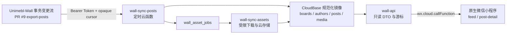

# 微信小程序只读镜像基础架构

## 1. 设计结论

本工程采用“源站事务变更流 → CloudBase 镜像 → 只读云函数 → 原生小程序”的四层结构。小程序不接触 Supabase URL、`POST_EXPORT_API_TOKEN`、`service_role`、源表名或任意查询表达式。



PR #9 已提供事务内变更记录、物理删除墓碑和从游标 `0` 开始的初始回填，因此旧方案中基于 `updated_at` 的重叠窗口与每日全量核对不再是正确性的主机制。若源端未来清理历史变更，必须先提供一致性快照端点和 `410 CURSOR_EXPIRED` 语义。

## 2. 与 PR #9 的关键适配

| 旧开发文档假设 | PR #9 实际契约 | 本工程处理 |
| --- | --- | --- |
| `after_updated_at + after_id` | 不透明 `cursor` | 游标原样保存和回传，客户端不解析 |
| API 直接返回帖子数组 | `changes[]` 包含五种实体 | 按 `seq` 顺序分派到实体处理器 |
| `published/hidden/deleted` 是顶层变更 | `operation=upsert/delete`，软删除在帖子 payload 内 | 物理删除执行删除；软删除/隐藏保留镜像但不公开 |
| 每日全量核对修复硬删除 | 事务日志带物理删除墓碑 | 正常持续消费即可；另做运维审计而非盲目全量隐藏 |
| 图片/视频 URL 可直接进入客户端 | 媒体二进制必须独立复制且需要防 SSRF | 仅把已成功复制的 CloudBase `fileID` 返回客户端 |
| 通过空 `authorId` 推断匿名 | 帖子 payload 显式提供 `isAnonymous` | 匿名帖清除作者关联、认证标记和头像快照 |

## 3. CloudBase 数据模型

### `wall_boards`

保存 `board` 公开字段：`_id`、`name`、`slug`、`description`、`sort_order`、`enabled`、`source_last_seq`。

### `wall_authors`

保存 `author` 公开投影：`_id`、`username`、头像裁剪参数、`role`、`verified`、`source_last_seq`。不保存邮箱、Auth 数据或封禁信息。

### `wall_posts`

既是帖子规范化镜像，也是列表与详情读模型。除 PR payload 字段外，保存：

- `mirror_status`：`published | hidden | deleted | unavailable`
- `pin_rank`：把布尔置顶转换为可稳定排序的 `1 | 0`
- `category`、`author`：板块和作者的公开快照
- `is_anonymous`：源 `isAnonymous` 的显式镜像；为真时不保存帖子作者关联
- `media`：仅含已完成复制的 `file_id`、`image | video` 类型、尺寸和顺序
- `images`：从 `media` 派生的图片兼容字段，供列表缩略图和旧客户端使用
- `excerpt`：同步时生成的纯文本摘要
- `published_at`：第一版使用源 `createdAt`
- `source_last_seq`：字符串形式的最近事件序列号

公开列表索引：

```text
mirror_status + board_enabled + pin_rank + published_at + _id
mirror_status + board_enabled + board_id + pin_rank + published_at + _id
author_id
board_id
```

### `wall_post_media`

保存媒体元数据和镜像状态：`_id`、`post_id`、`type`、`source_url`、尺寸、替代文字、位置、`mirror_file_id`、`asset_status`、`source_last_seq`。

### 运行与队列集合

- `wall_sync_state`：固定文档 `_id=post-export`，保存源实例、游标、锁、最近成功时间和连续失败次数。
- `wall_sync_runs`：每次执行的计数、游标范围、high-water mark 和错误摘要。
- `wall_asset_jobs`：媒体下载任务、重试次数和下次执行时间。

第一版不保存 `comment` 实体。PR #9 的帖子 payload 已含 `commentCount`，这足以满足只读数字展示，也避免复制第一版不展示的评论正文。

## 4. 同步一致性

1. `wall-sync-posts` 通过事务获取带过期时间的同步锁。
2. 从 `wall_sync_state.cursor` 请求一页；首次运行不传游标，相当于从序列 `0` 开始。
3. 校验 `apiVersion`、`sourceInstance`、游标、事件形状和严格递增的十进制字符串 `seq`。
4. 按顺序应用变更。每个实体记录 `source_last_seq`，旧事件和重复事件直接跳过。
5. 一页全部处理成功后才保存 `nextCursor`。若处理中断，下一次会重放该页，实体序列号保证幂等。
6. `hasMore=true` 时继续拉取，直到清空积压或达到单次页数上限。

CloudBase 不适合把包含板块/作者扇出更新的一整页放进一个大型事务。因此这里采用“逐实体幂等写入 + 页末游标提交”，仍满足不漏数：崩溃只会造成安全重放，不会越过未完成事件。

## 5. 只读 API

客户端只能调用以下动作：

```text
posts.list
posts.get
categories.list
sync.status
```

`posts.list` 使用服务端生成的不透明游标，内部排序键为：

```text
pin_rank DESC, published_at DESC, _id DESC
```

游标绑定当前分类，防止跨筛选条件误用。列表最大 20 条；详情仅返回 `mirror_status=published` 且板块启用的帖子。

## 6. 小程序状态边界

- 页面负责加载状态、刷新、分页和路由。
- `services/wall-api.js` 负责云函数调用、响应校验和错误标准化。
- `services/cache.js` 只缓存首屏与详情，默认五分钟；CloudBase 始终是正式数据源。
- WXML 只渲染纯文本，不接收任意 HTML。
- 图片预览与视频播放只使用已镜像的 CloudBase `fileID`。

## 7. 安全边界

- `POST_EXPORT_API_TOKEN` 只存在于 `wall-sync-posts` 云函数环境变量。
- CloudBase 集合不向小程序客户端开放直接读取。
- 函数调用安全规则仅允许客户端调用 `wall-api`；定时同步和媒体函数禁止客户端调用。
- 源媒体只允许 HTTPS 且主机名必须在 `SOURCE_MEDIA_HOSTS` 白名单中；限制响应体大小、超时和 MIME 类型，不跟随未验证重定向。声明为图片的记录只接受受支持图片 MIME，声明为视频的记录只接受 MP4。
- 日志不记录 Token、Authorization、完整二进制或服务端密钥。

## 8. 微信与 CloudBase 文档依据

- [微信小程序全局配置 `app.json`](https://developers.weixin.qq.com/miniprogram/dev/reference/configuration/app.html)
- [微信小程序 `Page` 生命周期](https://developers.weixin.qq.com/miniprogram/dev/reference/api/Page.html)
- [微信云开发 `wx.cloud.callFunction`](https://developers.weixin.qq.com/miniprogram/dev/wxcloud/reference-sdk-api/functions/Cloud.callFunction.html)
- [微信小程序图片预览 `wx.previewImage`](https://developers.weixin.qq.com/miniprogram/dev/api/media/image/wx.previewImage.html)
- [微信小程序 `video` 组件](https://developers.weixin.qq.com/miniprogram/dev/component/video.html)
- [CloudBase 定时触发器](https://docs.cloudbase.net/cloud-function/timer-trigger)
- [CloudBase 云函数安全规则](https://docs.cloudbase.net/cloud-function/security-rules)
